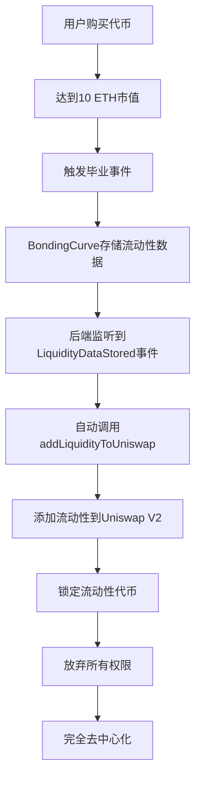

# 🚀 0xcafe.fun - MEME 代币发射平台

一个完整的去中心化 MEME 代币创造与交易平台，采用 **Bonding Curve** 机制实现公平价格发现、自动毕业系统和智能流动性管理。


## ✨ 核心特性

### 🎯 **Bonding Curve 交易机制**
- **动态定价算法**: 价格随购买量增长，防止操控
- **公平价格发现**: 早期支持者获得更低价格
- **自动流动性**: 无需人工做市，算法自动提供流动性

### 🎓 **自动毕业系统**
- **市值毕业门槛**: 达到 10 ETH 市值自动毕业
- **智能流动性管理**: 自动添加流动性到 Uniswap V2
- **永久锁定**: 毕业后流动性永久锁定，防止 Rug Pull
- **完全去中心化**: 毕业后放弃所有权限，实现真正去中心化

### 🌟 **Vanity 地址生成**
- **个性化地址**: 生成以 "0xcafe" 开头的合约地址
- **CREATE2 技术**: 预计算地址，确保唯一性
- **高速生成**: 本地算法，平均 10,000+ 次/秒计算速度

### 🤖 **自动流动性监控**
- **实时事件监听**: 检测代币毕业和流动性数据存储
- **智能交易执行**: 自动调用流动性添加功能
- **API 管理界面**: RESTful API 控制监控系统
- **错误处理与重试**: 完整的异常处理和自动重试机制

### 💰 **费用分配机制**
- **平台费用**: 2% 交易手续费
- **创建者分成**: 3% 交易收益分成
- **可持续发展**: 为平台和创建者提供持续收益

## 🏗️ 完整架构

```
0xcafe.fun/
├── 📁 src/                    # 智能合约层
│   ├── MemeToken.sol           # ERC20 代币合约
│   ├── MemeFactory.sol         # CREATE2 工厂合约
│   ├── MemePlatform.sol        # 平台管理合约
│   ├── BondingCurve.sol        # 交易和毕业逻辑
│   ├── LiquidityManager.sol    # 流动性管理合约
│   └── FeeManager.sol          # 费用管理合约
├── 📁 frontend/               # Web 应用层
│   ├── src/app/               # Next.js 14 页面路由
│   ├── src/components/        # React UI 组件
│   ├── src/hooks/            # 自定义 React Hooks
│   └── src/config/           # Web3 配置
├── 📁 backend/               # 服务层
│   ├── src/services/         # 核心服务
│   │   ├── liquidityMonitor.ts  # 流动性监控服务
│   │   ├── blockchain.ts        # 区块链交互服务
│   │   └── cache.ts            # 缓存服务
│   ├── src/routes/           # API 路由
│   └── src/clients/          # 外部客户端
├── 📁 script/                # 部署脚本
├── 📁 shell/                 # 工具脚本
└── 📁 test/                  # 测试文件
```

## 🚀 快速开始

### 环境准备

```bash
# 安装 Foundry
curl -L https://foundry.paradigm.xyz | bash
foundryup

# 安装 Node.js 依赖
npm install

# 安装前端依赖
cd frontend && npm install

# 安装后端依赖
cd ../backend && npm install
```

### 本地开发

1. **启动本地区块链**:
```bash
anvil
```

2. **部署智能合约**:
```bash
./local-deploy.sh
```

3. **启动后端服务**:
```bash
cd backend
npm run dev
```

4. **启动前端应用**:
```bash
cd frontend
npm run dev
```

5. **访问应用**: 
   - 前端: http://localhost:3000
   - 后端 API: http://localhost:9000

## 📋 系统组件

### 🔗 智能合约层
- **MemeToken**: ERC20 代币实现，Minter角色才能铸造
- **MemeFactory**: CREATE2 工厂，生成 vanity 地址
- **BondingCurve**: 核心交易逻辑和自动毕业机制
- **LiquidityManager**: 管理 Uniswap 流动性添加和锁定
- **FeeManager**: 统一费用计算和分配

### 🖥️ 前端应用
- **代币创建**: 完整的创建流程和 vanity 地址生成
- **交易市场**: 实时价格和交易功能
- **毕业追踪**: 可视化毕业进度
- **钱包集成**: 支持主流以太坊钱包

### ⚙️ 后端服务
- **流动性监控**: 实时监听区块链事件
- **API 管理**: RESTful API 控制台
- **自动化执行**: 智能合约自动调用
- **状态管理**: 监控系统状态和配置

## 🔄 自动流动性工作流程



## 💡 核心算法

### Bonding Curve 定价公式

```solidity
// 线性价格增长模型
function getCurrentPrice(address token) public view returns (uint256) {
    CurveParams memory params = curveParams[token];
    uint256 currentSupply = MemeToken(token).currentSupply();
    
    if (currentSupply == 0) return params.initialPrice;
    
    // P = initialPrice + k * currentSupply
    // k = (targetPrice - initialPrice) / targetSupply
    return params.initialPrice + 
           (params.targetPrice - params.initialPrice) * 
           currentSupply / params.targetSupply;
}
```

### CREATE2 地址生成

```typescript
// Vanity 地址生成算法
const generateVanityAddress = async (prefix: string) => {
  const bytecode = await factory.getBytecode(params);
  
  for (let i = 0; i < maxAttempts; i++) {
    const salt = keccak256(randomBytes(32));
    const address = getCreate2Address(factoryAddress, salt, keccak256(bytecode));
    
    if (address.toLowerCase().startsWith(prefix.toLowerCase())) {
      return { address, salt, attempts: i + 1 };
    }
  }
};
```

## 🛠️ 技术栈

### 智能合约
- **Solidity 0.8.29**: 最新稳定版本
- **Foundry**: 开发和测试框架
- **OpenZeppelin**: 安全的合约库

### 前端应用
- **Next.js 14**: React 全栈框架 (App Router)
- **TypeScript**: 类型安全开发
- **RainbowKit + wagmi**: Web3 钱包连接
- **Ant Design**: 现代化 UI 组件库
- **Tailwind CSS**: 原子化 CSS 框架

### 后端服务
- **Node.js + Express**: 服务器框架
- **TypeScript**: 类型安全服务端开发
- **Viem**: 轻量级以太坊库
- **dotenv**: 环境配置管理

## 📈 平台统计

| 指标 | 描述 |
|------|------|
| 🏠 Vanity地址生成 | 基于CREATE2预计算技术，在前端本地生成“0xcafe”开头Token合约地址 |
| 🚀 公平发射 | Bonding Curve确保价格发现公平透明 |
| 🎯 完全去中心化 | 毕业后彻底丢弃Minter铸币权，防止rug pull |
| 🎓 自动毕业 | 后端检测Token达到10ETH市值事件，自动添加流动性到DEX，无需人工干预 |
