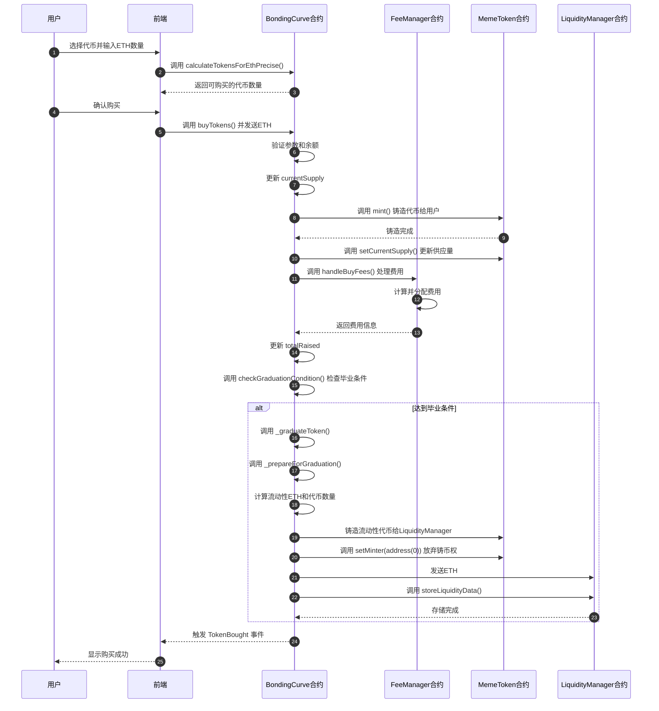
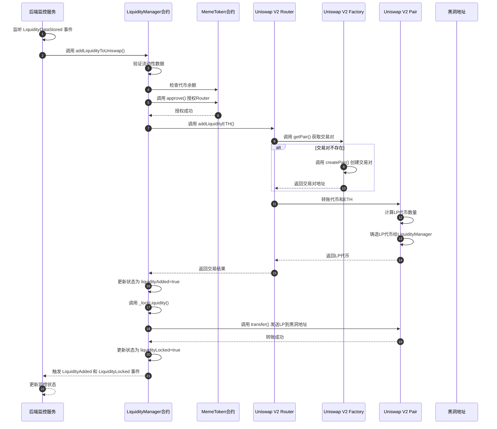
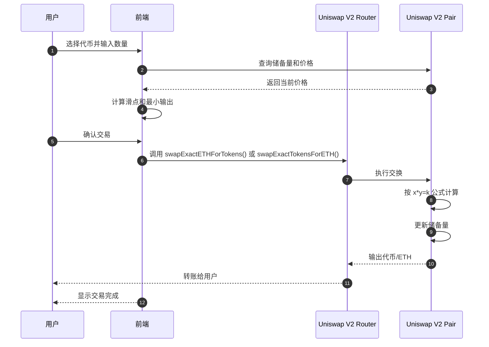

# 🚀 0xcafe.fun - MEME Launch 平台

一个 MEME Launch 平台，采用 **Bonding Curve** 机制实现公平价格发现、自动毕业系统和智能流动性管理。

[](https://github.com/0xSnickers/0xcafedotfun)
[](https://nextjs.org/)
[](https://soliditylang.org/)
[](https://www.typescriptlang.org/)

---

## ✨ 核心特性

### 🎯 Bonding Curve 交易机制
- **动态定价**：价格随购买量增长，防止操控
- **公平价格发现**：早期支持者获得更低价格
- **自动流动性**：无需人工做市

### 🎓 自动毕业系统
- **市值毕业门槛**：达到 10 ETH 市值自动毕业
- **Uniswap 集成**：自动添加流动性到 Uniswap V2
- **永久锁定**：流动性永久锁定，防止 Rug Pull
- **完全去中心化**：毕业后放弃所有权限

### 🌟 Vanity 地址生成
- **个性化地址**：生成 "0xcafe" 开头的合约地址
- **CREATE2 技术**：预计算地址，确保唯一性
- **高速生成**：本地算法，平均 10,000+ 次/秒

### 🤖 自动流动性监控
- **实时事件监听**：检测代币毕业事件
- **智能交易执行**：自动调用流动性添加
- **API 管理界面**：RESTful 控制接口
- **错误处理与重试**：完整的异常处理

### 💰 费用分配机制
- **平台费用**：2% 交易手续费
- **创建者分成**：3% 交易收益分成
- **可持续发展**：为平台和创建者提供持续收益

## 🏗️ 架构

```
0xcafe.fun/
├── 📁 src/              # 智能合约层
│   ├── MemeToken.sol      # ERC20 代币
│   ├── MemeFactory.sol    # CREATE2 工厂
│   ├── BondingCurve.sol   # 交易与毕业逻辑
│   ├── LiquidityManager.sol # 流动性管理
│   └── FeeManager.sol     # 费用管理
├── 📁 frontend/         # 前端应用 (Next.js)
├── 📁 backend/          # 后端服务 (Node.js)
└── 📁 script/           # 部署脚本
```

## 🛠️ 技术栈

| 层级 | 技术 |
|-------|--------------|
| **智能合约** | Solidity 0.8.29, Foundry, OpenZeppelin |
| **前端** | Next.js 14, TypeScript, RainbowKit, wagmi, Ant Design, Tailwind |
| **后端** | Node.js, Express, TypeScript, Viem |
| **本地 DEX** | Hardhat, Uniswap V2, Next.js |


## 🚀 快速开始

### 环境准备
```bash
# 安装 Foundry
curl -L https://foundry.paradigm.xyz | bash
foundryup

# 安装依赖
npm install
cd frontend && npm install
cd ../backend && npm install
```

### 本地开发
```bash
# 1. 启动本地区块链
anvil

# 2. 部署合约
./local-deploy.sh

# 3. 启动后端 (端口 9000)
cd backend && npm run dev

# 4. 启动前端 (端口 3000)
cd frontend && npm run dev
```

## 🔄 完整调用流程

### 📊 代币购买流程


```mermaid
sequenceDiagram
    autonumber
    participant User as 用户
    participant Frontend as 前端
    participant BondingCurve as BondingCurve合约
    participant FeeManager as FeeManager合约
    participant MemeToken as MemeToken合约
    participant LiquidityManager as LiquidityManager合约
    
    User->>Frontend: 选择代币并输入ETH数量
    Frontend->>BondingCurve: 调用 calculateTokensForEthPrecise()
    BondingCurve-->>Frontend: 返回可购买的代币数量
    User->>Frontend: 确认购买
    Frontend->>BondingCurve: 调用 buyTokens() 并发送ETH
    BondingCurve->>BondingCurve: 验证参数和余额
    BondingCurve->>BondingCurve: 更新 currentSupply
    BondingCurve->>MemeToken: 调用 mint() 铸造代币给用户
    MemeToken-->>BondingCurve: 铸造完成
    BondingCurve->>MemeToken: 调用 setCurrentSupply() 更新供应量
    BondingCurve->>FeeManager: 调用 handleBuyFees() 处理费用
    FeeManager->>FeeManager: 计算并分配费用
    FeeManager-->>BondingCurve: 返回费用信息
    BondingCurve->>BondingCurve: 更新 totalRaised
    BondingCurve->>BondingCurve: 调用 checkGraduationCondition() 检查毕业条件
    alt 达到毕业条件
        BondingCurve->>BondingCurve: 调用 _graduateToken()
        BondingCurve->>BondingCurve: 调用 _prepareForGraduation()
        BondingCurve->>BondingCurve: 计算流动性ETH和代币数量
        BondingCurve->>MemeToken: 铸造流动性代币给LiquidityManager
        BondingCurve->>MemeToken: 调用 setMinter(address(0)) 放弃铸币权
        BondingCurve->>LiquidityManager: 发送ETH
        BondingCurve->>LiquidityManager: 调用 storeLiquidityData()
        LiquidityManager-->>BondingCurve: 存储完成
    end
    BondingCurve-->>Frontend: 触发 TokenBought 事件
    Frontend-->>User: 显示购买成功
```

### 🎓 毕业与流动性添加流程


```mermaid
sequenceDiagram
    autonumber
    participant Backend as 后端监控服务
    participant LiquidityManager as LiquidityManager合约
    participant MemeToken as MemeToken合约
    participant UniswapRouter as Uniswap V2 Router
    participant UniswapFactory as Uniswap V2 Factory
    participant UniswapPair as Uniswap V2 Pair
    participant DeadAddress as 黑洞地址
    
    Backend->>Backend: 监听 LiquidityDataStored 事件
    Backend->>LiquidityManager: 调用 addLiquidityToUniswap()
    LiquidityManager->>LiquidityManager: 验证流动性数据
    LiquidityManager->>MemeToken: 检查代币余额
    LiquidityManager->>MemeToken: 调用 approve() 授权Router
    MemeToken-->>LiquidityManager: 授权成功
    LiquidityManager->>UniswapRouter: 调用 addLiquidityETH()
    UniswapRouter->>UniswapFactory: 调用 getPair() 获取交易对
    alt 交易对不存在
        UniswapFactory->>UniswapFactory: 调用 createPair() 创建交易对
        UniswapFactory-->>UniswapRouter: 返回交易对地址
    end
    UniswapRouter->>UniswapPair: 转账代币和ETH
    UniswapPair->>UniswapPair: 计算LP代币数量
    UniswapPair->>UniswapPair: 铸造LP代币给LiquidityManager
    UniswapPair-->>UniswapRouter: 返回LP代币
    UniswapRouter-->>LiquidityManager: 返回交易结果
    LiquidityManager->>LiquidityManager: 更新状态为 liquidityAdded=true
    LiquidityManager->>LiquidityManager: 调用 _lockLiquidity()
    LiquidityManager->>UniswapPair: 调用 transfer() 发送LP到黑洞地址
    UniswapPair-->>LiquidityManager: 转账成功
    LiquidityManager->>LiquidityManager: 更新状态为 liquidityLocked=true
    LiquidityManager-->>Backend: 触发 LiquidityAdded 和 LiquidityLocked 事件
    Backend-->>Backend: 更新监控状态
```

### 💱 毕业后代币交易流程


```mermaid
sequenceDiagram
    autonumber
    participant User as 用户
    participant Frontend as 前端
    participant UniswapRouter as Uniswap V2 Router
    participant UniswapPair as Uniswap V2 Pair
    
    User->>Frontend: 选择代币并输入数量
    Frontend->>UniswapPair: 查询储备量和价格
    UniswapPair-->>Frontend: 返回当前价格
    Frontend->>Frontend: 计算滑点和最小输出
    User->>Frontend: 确认交易
    Frontend->>UniswapRouter: 调用 swapExactETHForTokens() 或 swapExactTokensForETH()
    UniswapRouter->>UniswapPair: 执行交换
    UniswapPair->>UniswapPair: 按 x*y=k 公式计算
    UniswapPair->>UniswapPair: 更新储备量
    UniswapPair-->>UniswapRouter: 输出代币/ETH
    UniswapRouter-->>User: 转账给用户
    Frontend-->>User: 显示交易完成
```

## 🏪 本地 Uniswap V2 DEX

为了本地开发和测试，我提供了 Uniswap V2 DEX 实现，可以在开发环境中模拟实现自动添加流动性功能。

[](https://github.com/0xSnickers/0xcafe-uniswapV2-dex)

### 🎯 核心功能
- **完整 Uniswap V2 实现** - Factory、Router、Pair 合约
- **本地测试** - 可部署到 Hardhat 网络
- **流动性管理** - 添加/移除流动性测试
- **代币交换** - 完整的 AMM 功能

### 🚀 快速设置
```bash
# 克隆 DEX 仓库
git clone https://github.com/0xSnickers/0xcafe-uniswapV2-dex.git
cd 0xcafe-uniswapV2-dex

# 安装依赖
npm install

# 启动本地网络并部署
npx hardhat node
npx hardhat run scripts/deploy.ts --network hardhat

# 启动前端
cd frontend && npm run dev
```

---

## ⭐ Star History

[](https://star-history.com/#0xSnickers/0xcafedotfun&Date)
