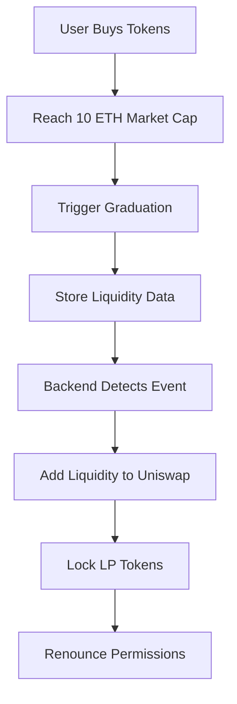

# 🚀 0xcafe.fun - MEME Token Launch Platform

A fully decentralized MEME token creation and trading platform with **Bonding Curve** mechanism for fair price discovery, auto-graduation system, and smart liquidity management.

[](https://github.com/0xSnickers/0xcafedotfun)
[](https://nextjs.org/)
[](https://soliditylang.org/)
[](https://www.typescriptlang.org/)

---

## 📖 中文文档 | Chinese Documentation

[点击这里查看中文版本](#-中文文档--chinese-documentation-1)

---

## ✨ Core Features

### 🎯 Bonding Curve Trading
- **Dynamic Pricing**: Price grows with purchase volume to prevent manipulation
- **Fair Discovery**: Early supporters get lower prices
- **Auto Liquidity**: No manual market making needed

### 🎓 Auto-Graduation System
- **Market Cap Threshold**: Auto-graduate at 10 ETH market cap
- **Uniswap Integration**: Auto-add liquidity to Uniswap V2
- **Permanent Lock**: Liquidity locked forever, no rug pull
- **Decentralized**: Renounce all permissions post-graduation

### 🌟 Vanity Addresses
- **Personalized**: Generate "0xcafe" prefixed contract addresses
- **CREATE2**: Precompute addresses for uniqueness
- **High Speed**: Local algorithm, 10,000+ attempts/sec

### 🤖 Auto Liquidity Monitor
- **Event Listening**: Real-time graduation detection
- **Smart Execution**: Auto-call liquidity addition
- **API Management**: RESTful control interface
- **Error Handling**: Complete exception handling and retries

### 💰 Fee Distribution
- **Platform Fee**: 2% transaction fee
- **Creator Share**: 3% revenue share for creators
- **Sustainable**: Continuous income for platform and creators

## 🏗️ Architecture

```
0xcafe.fun/
├── 📁 src/              # Smart Contracts
│   ├── MemeToken.sol      # ERC20 Token
│   ├── MemeFactory.sol    # CREATE2 Factory
│   ├── BondingCurve.sol   # Trading & Graduation
│   ├── LiquidityManager.sol # Liquidity Mgmt
│   └── FeeManager.sol     # Fee Mgmt
├── 📁 frontend/         # Web App (Next.js)
├── 📁 backend/          # Services (Node.js)
└── 📁 script/           # Deployment Scripts
```

## 🚀 Quick Start

### Prerequisites
```bash
# Install Foundry
curl -L https://foundry.paradigm.xyz | bash
foundryup

# Install dependencies
npm install
cd frontend && npm install
cd ../backend && npm install
```

### Local Development
```bash
# 1. Start local blockchain
anvil

# 2. Deploy contracts
./local-deploy.sh

# 3. Start backend (port 9000)
cd backend && npm run dev

# 4. Start frontend (port 3000)
cd frontend && npm run dev
```

## 🔄 Workflow


```mermaid
graph TD
    A[User Buys Tokens] --> B[Reach 10 ETH Market Cap]
    B --> C[Trigger Graduation]
    C --> D[Store Liquidity Data]
    D --> E[Backend Detects Event]
    E --> F[Add Liquidity to Uniswap]
    F --> G[Lock LP Tokens]
    G --> H[Renounce Permissions]
```

## �️ Tech Stack

| Layer | Technologies |
|-------|--------------|
| **Smart Contracts** | Solidity 0.8.29, Foundry, OpenZeppelin |
| **Frontend** | Next.js 14, TypeScript, RainbowKit, wagmi, Ant Design, Tailwind |
| **Backend** | Node.js, Express, TypeScript, Viem |

---

## 📖 中文文档 | Chinese Documentation

一个完整的去中心化 MEME 代币创造与交易平台，采用 **Bonding Curve** 机制实现公平价格发现、自动毕业系统和智能流动性管理。

## ✨ 核心特性

### 🎯 Bonding Curve 交易机制
- **动态定价**：价格随购买量增长，防止操控
- **公平价格发现**：早期支持者获得更低价格
- **自动流动性**：无需人工做市

### 🎓 自动毕业系统
- **市值毕业门槛**：达到 10 ETH 市值自动毕业
- **Uniswap 集成**：自动添加流动性到 Uniswap V2
- **永久锁定**：流动性永久锁定，防止 Rug Pull
- **完全去中心化**：毕业后放弃所有权限

### 🌟 Vanity 地址生成
- **个性化地址**：生成 "0xcafe" 开头的合约地址
- **CREATE2 技术**：预计算地址，确保唯一性
- **高速生成**：本地算法，平均 10,000+ 次/秒

### 🤖 自动流动性监控
- **实时事件监听**：检测代币毕业事件
- **智能交易执行**：自动调用流动性添加
- **API 管理界面**：RESTful 控制接口
- **错误处理与重试**：完整的异常处理

### 💰 费用分配机制
- **平台费用**：2% 交易手续费
- **创建者分成**：3% 交易收益分成
- **可持续发展**：为平台和创建者提供持续收益

## 🏗️ 架构

```
0xcafe.fun/
├── 📁 src/              # 智能合约层
│   ├── MemeToken.sol      # ERC20 代币
│   ├── MemeFactory.sol    # CREATE2 工厂
│   ├── BondingCurve.sol   # 交易与毕业逻辑
│   ├── LiquidityManager.sol # 流动性管理
│   └── FeeManager.sol     # 费用管理
├── 📁 frontend/         # 前端应用 (Next.js)
├── 📁 backend/          # 后端服务 (Node.js)
└── 📁 script/           # 部署脚本
```

## � 快速开始

### 环境准备
```bash
# 安装 Foundry
curl -L https://foundry.paradigm.xyz | bash
foundryup

# 安装依赖
npm install
cd frontend && npm install
cd ../backend && npm install
```

### 本地开发
```bash
# 1. 启动本地区块链
anvil

# 2. 部署合约
./local-deploy.sh

# 3. 启动后端 (端口 9000)
cd backend && npm run dev

# 4. 启动前端 (端口 3000)
cd frontend && npm run dev
```

---

## ⭐ Star History

[](https://star-history.com/#0xSnickers/0xcafedotfun&Date)

---

## 📄 License

MIT
