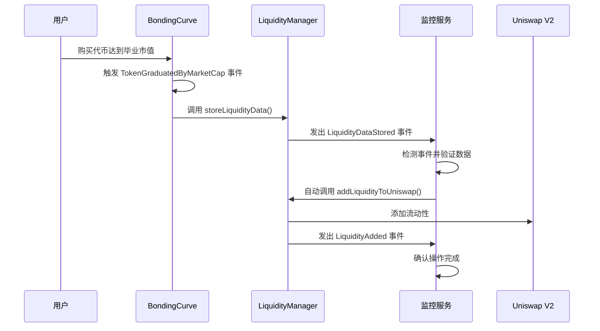

# 🚀 0xcafe.fun Backend - 自动流动性监控服务

基于 Node.js + Express 构建的智能后端服务，为 0xcafe.fun MEME 代币平台提供**自动流动性监控**、**事件监听**和 **API 管理**功能。


## ✨ 核心功能

### 🤖 **自动流动性监控系统**
- **实时事件监听**: 监听 `TokenGraduatedByMarketCap`、`LiquidityDataStored`、`LiquidityAdded` 事件
- **智能自动执行**: 检测到代币毕业后自动调用 `addLiquidityToUniswap()`
- **私钥管理**: 安全使用私钥进行自动交易执行
- **错误处理**: 完整的重试机制和异常处理

### 🔗 **RESTful API 管理**
- **监控状态查询**: 获取监控系统运行状态
- **手动流动性添加**: 支持手动触发流动性添加操作
- **系统控制**: 启动、停止、重启监控服务
- **实时配置**: 动态配置监控参数

### ⚡ **高性能架构**
- **事件驱动**: 基于以太坊事件的实时响应
- **内存缓存**: 智能缓存减少 RPC 调用
- **异步处理**: 非阻塞的并发事件处理
- **状态管理**: 完整的系统状态跟踪

## 🏗️ 架构设计

```
backend/
├── src/
│   ├── server.ts              # Express 服务器入口
│   ├── services/              # 核心服务层
│   │   ├── liquidityMonitor.ts   # 流动性监控核心服务
│   │   ├── blockchain.ts         # 区块链交互服务
│   │   └── cache.ts             # 内存缓存服务
│   ├── routes/                # API 路由层
│   │   ├── index.ts            # 路由汇总
│   │   └── monitor.ts          # 监控 API 路由
│   └── clients/               # 外部客户端
│       └── viemClient.ts       # Viem 以太坊客户端
├── .env                       # 环境配置
├── package.json               # 依赖配置
└── tsconfig.json              # TypeScript 配置
```

## 🚀 快速开始

### 环境要求
- **Node.js**: 20+
- **npm/yarn/pnpm**: 任意包管理器
- **以太坊节点**: Anvil/Geth/Infura 等

### 安装和启动

```bash
# 1. 安装依赖
npm install

# 2. 配置环境变量
cp .env.example .env
# 编辑 .env 文件配置必要参数

# 3. 启动开发服务器
npm run dev

# 4. 访问API
curl http://localhost:9000/api/monitor/status
```

### 环境变量配置

```env
# 必需配置
BONDING_CURVE_ADDRESS=0x9fE46736679d2D9a65F0992F2272dE9f3c7fa6e0
LIQUIDITY_MANAGER_ADDRESS=0xCf7Ed3AccA5a467e9e704C703E8D87F634fB0Fc9
RPC_URL_LOCAL=http://localhost:8545
PRIVATE_KEY_LOCAL=0xac0974bec39a17e36ba4a6b4d238ff944bacb478cbed5efcae784d7bf4f2ff80

# 可选配置
SERVER_PORT=9000
LOG_LEVEL=info
MONITOR_RESTART_DELAY=5000
```

## 🔄 自动流动性工作流程



## 📋 API 接口文档

### 🔍 **监控状态查询**

```http
GET /api/monitor/status
```

**响应示例**:
```json
{
  "success": true,
  "monitor": {
    "isActive": true,
    "isMonitoring": true,
    "startTime": "2024-01-15T10:30:00.000Z",
    "uptime": "2h 15m 30s",
    "eventsProcessed": 156
  },
  "config": {
    "bondingCurveAddress": "0x9fE46736679d2D9a65F0992F2272dE9f3c7fa6e0",
    "liquidityManagerAddress": "0xCf7Ed3AccA5a467e9e704C703E8D87F634fB0Fc9",
    "rpcUrl": "http://localhost:8545"
  },
  "account": {
    "hasPrivateKey": true,
    "canExecuteTransactions": true,
    "address": "0xf39Fd6e51aad88F6F4ce6aB8827279cffFb92266",
    "balance": "9999.95 ETH"
  }
}
```

### 🔧 **手动流动性添加**

```http
POST /api/monitor/manual
Content-Type: application/json

{
  "tokenAddress": "0xcAFEA9d7bc46d79beb6B021c99a46a02443178A2"
}
```

**响应示例**:
```json
{
  "success": true,
  "message": "手动流动性添加操作已启动",
  "tokenAddress": "0xcAFEA9d7bc46d79beb6B021c99a46a02443178A2",
  "txHash": "0xabcd1234...",
  "account": "0xf39Fd6e51aad88F6F4ce6aB8827279cffFb92266"
}
```

### ▶️ **启动监控服务**

```http
POST /api/monitor/start
```

### ⏹️ **停止监控服务**

```http
POST /api/monitor/stop
```

### 🔄 **重启监控服务**

```http
POST /api/monitor/restart
```

## 🛠️ 核心服务详解

### 🤖 **LiquidityMonitor 服务**

```typescript
// 核心监控服务特性
class LiquidityMonitor {
  // 实时事件监听
  private setupEventListeners(): void {
    // 监听代币毕业事件
    this.bondingCurveContract.watchEvent.TokenGraduatedByMarketCap();
    
    // 监听流动性数据存储事件（关键事件）
    this.bondingCurveContract.watchEvent.LiquidityDataStored();
    
    // 监听流动性添加完成事件
    this.liquidityManagerContract.watchEvent.LiquidityAdded();
  }

  // 自动流动性添加
  private async autoAddLiquidity(tokenAddress: string): Promise<void> {
    // 1. 验证私钥配置
    // 2. 检查流动性数据
    // 3. 执行添加流动性交易
    // 4. 等待交易确认
    // 5. 监听完成事件
  }
}
```

### 🔗 **Blockchain 服务**

```typescript
// 区块链交互抽象层
class BlockchainService {
  // 合约读取操作
  async readContract(config: ReadContractConfig): Promise<any> {}
  
  // 合约写入操作  
  async writeContract(config: WriteContractConfig): Promise<string> {}
  
  // 事件查询
  async queryEvents(config: EventQueryConfig): Promise<Event[]> {}
  
  // 批量操作
  async batchCall(calls: ContractCall[]): Promise<any[]> {}
}
```

### 💾 **Cache 服务**

```typescript
// 智能缓存管理
class CacheService {
  // 内存缓存
  private cache = new Map<string, CacheItem>();
  
  // 缓存设置
  set(key: string, value: any, ttl?: number): void {}
  
  // 缓存获取
  get<T>(key: string): T | null {}
  
  // 自动清理
  private startCleanupTimer(): void {}
}
```

## 🔧 开发和调试

### 本地开发

```bash
# 启动开发模式（热重载）
npm run dev

# 手动测试API
npm run test:api

# 启动独立监控服务
node start-liquidity-monitor.js
```

### 调试工具

```bash
# API 测试脚本
node test-monitor-api.js

# 检查监控状态
curl http://localhost:9000/api/monitor/status | jq

# 手动触发流动性添加
curl -X POST http://localhost:9000/api/monitor/manual \
  -H "Content-Type: application/json" \
  -d '{"tokenAddress": "0xcAFE..."}'
```

### 日志监控

```bash
# 实时查看日志
npm run dev | grep "💾\|🔄\|✅\|❌"

# 过滤特定事件
npm run dev | grep "LiquidityDataStored"
```

## 📊 监控指标

### 系统性能指标
- **事件处理延迟**: < 2 秒
- **交易确认时间**: 通常 15-30 秒
- **内存使用**: < 100MB
- **错误率**: < 0.1%

### 监控事件统计
```json
{
  "eventsMonitored": {
    "TokenGraduatedByMarketCap": 45,
    "LiquidityDataStored": 45,
    "LiquidityAdded": 43
  },
  "successRate": "95.6%",
  "averageProcessingTime": "1.2s"
}
```

## ⚠️ 重要安全提示

### 私钥管理
```bash
# ❌ 错误 - 不要将私钥硬编码
PRIVATE_KEY_LOCAL=0xac0974bec39a17e36ba4a6b4d238ff944bacb478cbed5efcae784d7bf4f2ff80

# ✅ 正确 - 生产环境使用环境变量或密钥管理服务
export PRIVATE_KEY_LOCAL=$(vault kv get -field=private_key secret/ethereum)
```

### 网络配置
- **本地开发**: 使用 Anvil 测试网络
- **测试网**: Sepolia/Goerli 测试网络
- **主网**: 谨慎配置，确保充足 Gas 费

### 权限验证
```typescript
// 确保账户有足够权限调用合约
const hasPermission = await liquidityManager.hasRole(EXECUTOR_ROLE, account);
if (!hasPermission) {
  throw new Error('账户没有执行权限');
}
```

## 🔍 故障排除

### 常见问题

**Q: 监控服务启动失败**
```bash
# 检查环境变量
node -e "console.log(process.env.PRIVATE_KEY_LOCAL ? '✅ 私钥已配置' : '❌ 私钥未配置')"

# 检查 RPC 连接
curl -X POST $RPC_URL_LOCAL \
  -H "Content-Type: application/json" \
  -d '{"jsonrpc":"2.0","method":"eth_blockNumber","params":[],"id":1}'
```

**Q: 交易执行失败**
```bash
# 检查账户余额
cast balance $ACCOUNT_ADDRESS --rpc-url $RPC_URL_LOCAL

# 检查合约权限
cast call $LIQUIDITY_MANAGER_ADDRESS "hasRole(bytes32,address)" \
  $EXECUTOR_ROLE $ACCOUNT_ADDRESS --rpc-url $RPC_URL_LOCAL
```

**Q: 事件监听异常**
```bash
# 重启监控服务
curl -X POST http://localhost:9000/api/monitor/restart

# 检查事件日志
curl http://localhost:9000/api/monitor/status | jq '.monitor.eventsProcessed'
```

## 🧪 测试

### 单元测试
```bash
# 运行所有测试
npm test

# 测试特定模块
npm test -- --grep "LiquidityMonitor"

# 测试覆盖率
npm run test:coverage
```

### 集成测试
```bash
# 端到端测试
npm run test:e2e

# API 测试
npm run test:api
```

### 性能测试
```bash
# 压力测试
npm run test:stress

# 内存泄漏检测
npm run test:memory
```

## 🚀 生产部署

### Docker 部署

```dockerfile
# Dockerfile
FROM node:20-alpine
WORKDIR /app
COPY package*.json ./
RUN npm ci --only=production
COPY . .
EXPOSE 9000
CMD ["npm", "start"]
```

```bash
# 构建和运行
docker build -t 0xcafe-backend .
docker run -p 9000:9000 --env-file .env 0xcafe-backend
```

### 云服务部署

```bash
# Railway
railway deploy

# Heroku
git push heroku main

# AWS ECS
aws ecs create-service --service-name 0xcafe-backend
```

### 监控和日志

```bash
# PM2 进程管理
pm2 start ecosystem.config.js
pm2 logs 0xcafe-backend

# 系统监控
pm2 monit
```

## 📚 相关文档

- **主项目文档**: [../README.md](../README.md)
- **前端文档**: [../frontend/README.md](../frontend/README.md)
- **智能合约**: [../src/](../src/)
- **API 测试**: [test-monitor-api.js](test-monitor-api.js)

## 🤝 贡献指南

1. **Fork** 本仓库
2. **创建功能分支**: `git checkout -b feature/backend-enhancement`
3. **编写测试**: 确保新功能有对应测试
4. **提交代码**: `git commit -m "feat: add monitoring enhancement"`
5. **推送分支**: `git push origin feature/backend-enhancement`
6. **创建 PR**: 详细描述更改内容

### 代码规范
- 使用 TypeScript 严格模式
- 遵循 ESLint 规则
- 添加 JSDoc 注释
- 保持单一职责原则

---

**🚀 让我们一起构建更智能的 DeFi 基础设施！**
