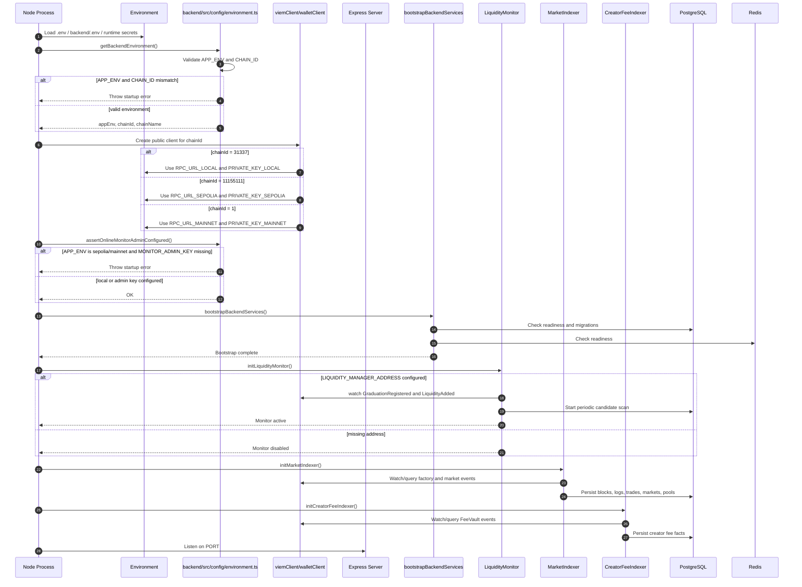
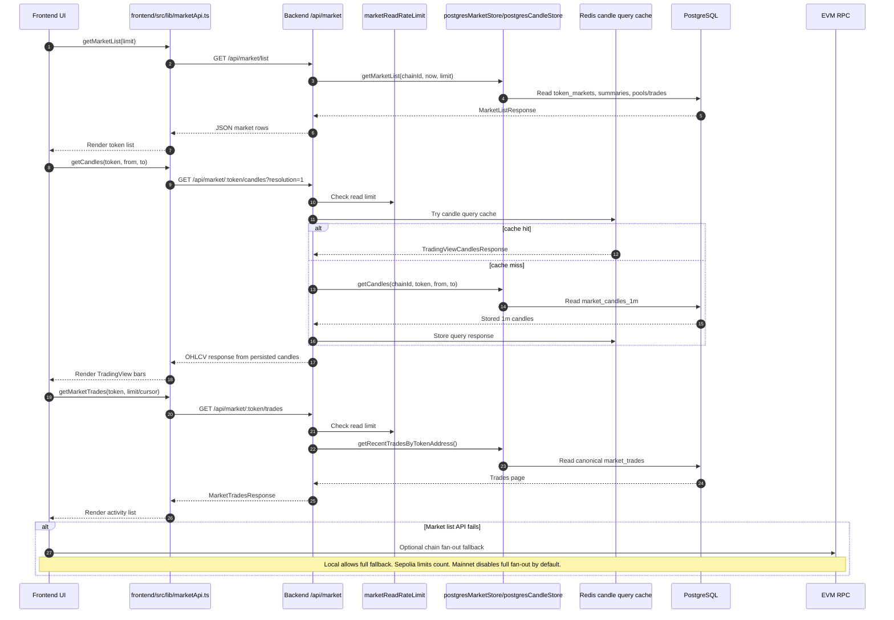
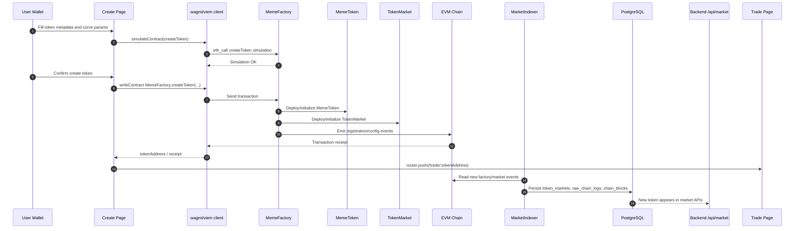
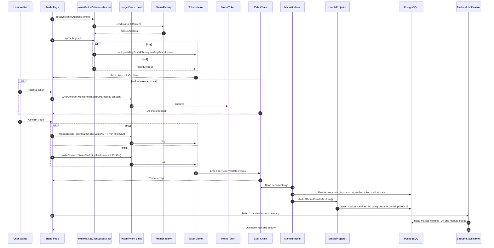
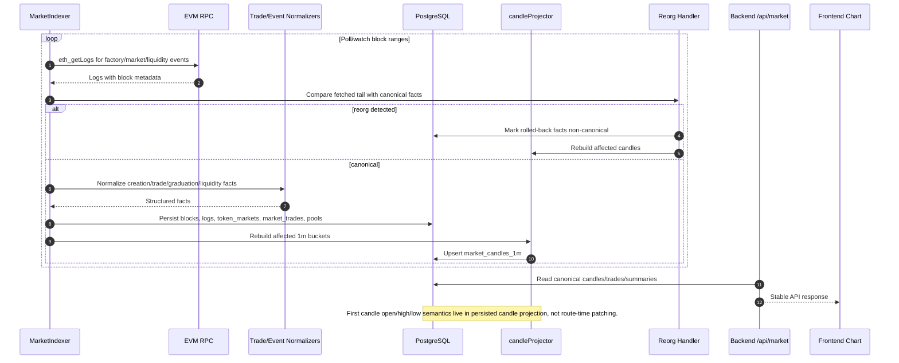
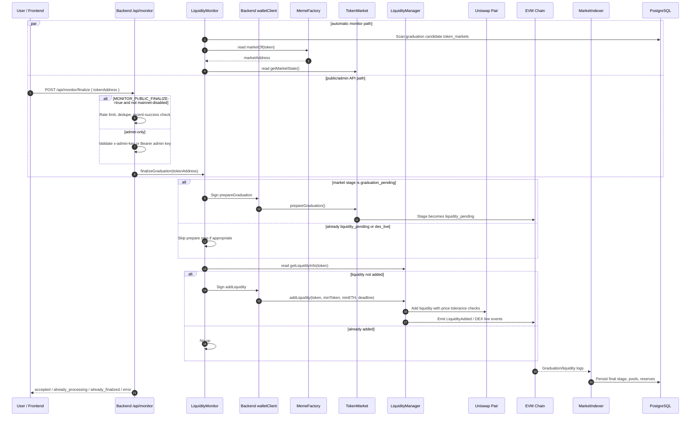
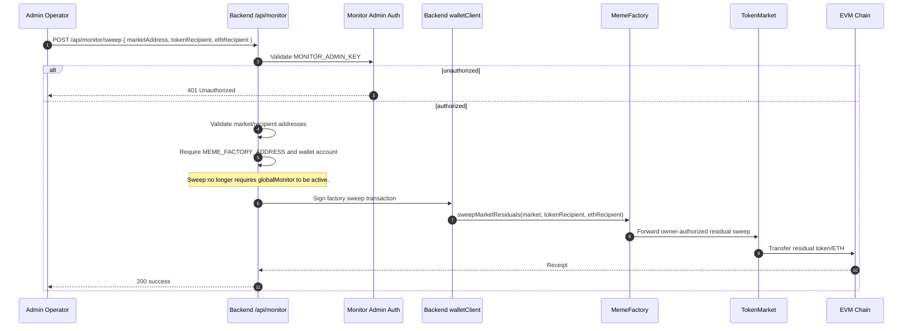
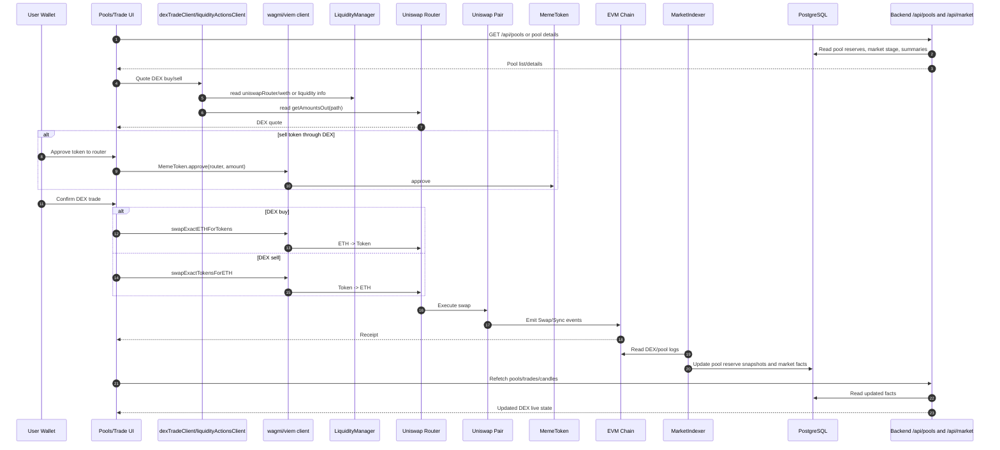
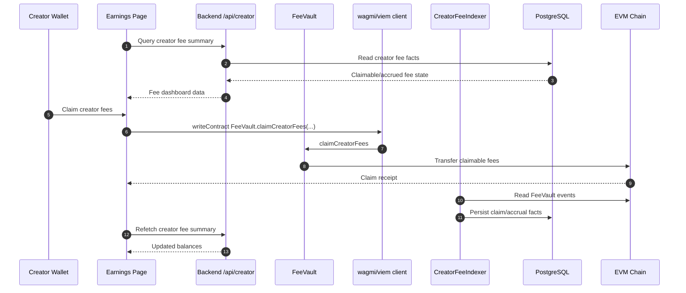

# 0xcafe.fun 最新系统架构与调用流程

更新时间：2026-06-22

本文用 Mermaid `sequenceDiagram` 描述当前项目的主要架构、数据流向和关键调用过程。当前系统核心由以下部分组成：

- Frontend：Next.js 前端，负责创建 token、交易、展示 K 线、池子和收益。
- Backend API：Express 后端，提供 market、monitor、pools、creator、growth、health 等接口。
- Chain Clients：后端 `viemClient` / `walletClient`，按 `APP_ENV + CHAIN_ID` 连接 Anvil / Sepolia / Mainnet。
- Indexers：MarketIndexer / CreatorFeeIndexer，从链上事件投影到 PostgreSQL。
- Storage：PostgreSQL 是市场、交易、K 线、池子等语义数据的主存储；Redis 用于缓存和辅助。
- Monitor/Keeper：后台 liquidity monitor 负责自动/手动完成毕业、加池和 residual sweep。
- Contracts：`MemeFactory`、`TokenMarket`、`LiquidityManager`、`FeeVault`、Uniswap Router/Pair。

## 1. 后端启动与环境选择

## 2. 前端读取市场列表、K 线和交易记录

## 3. Token 创建流程

## 4. Bonding Curve 买卖流程

## 5. 索引器、确认与 K 线投影

## 6. Graduation 自动毕业与加池

## 7. Residual Sweep 运维恢复流程

## 8. DEX Live 后交易与池子页面

## 9. Creator Fee 领取流程

